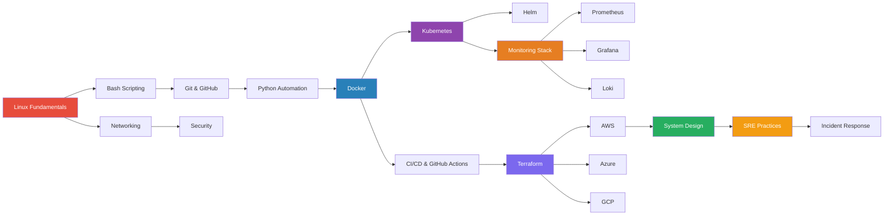

<p align="center">
  
</p>

<h1 align="center">🔧 DevOps Lab</h1>

<p align="center">
  <strong>A comprehensive, hands-on knowledge base for DevOps, SRE, and Cloud Infrastructure engineering.</strong>
</p>

<p align="center">
  <a href="https://github.com/thepatelsuraj/devops-lab/stargazers"></a>
  <a href="https://github.com/thepatelsuraj/devops-lab/network/members"></a>
  <a href="https://github.com/thepatelsuraj/devops-lab/blob/main/LICENSE"></a>
  <a href="https://github.com/thepatelsuraj/devops-lab/commits/main"></a>
  
  <a href="https://github.com/thepatelsuraj/devops-lab/actions"></a>
</p>

---

## 📖 About

**DevOps Lab** is a continuously evolving repository of practical knowledge, production-ready scripts, hands-on labs, and real-world examples covering the full DevOps and SRE landscape.

This is not a collection of bookmarks or copy-pasted snippets. Every piece of content is:

- ✅ Written with practical, real-world usage in mind
- ✅ Tested and validated before committing
- ✅ Documented with clear explanations
- ✅ Following industry best practices

Whether you're preparing for interviews, building infrastructure, or troubleshooting production issues — this repository has you covered.

---

## 🗺️ Learning Roadmap



---

## 📁 Repository Structure

```
devops-lab/
├── linux/                  # Linux commands, permissions, networking, systemd
├── docker/                 # Dockerfiles, Compose, networking, optimization
├── kubernetes/             # Pods, Deployments, Services, RBAC, Ingress
├── helm/                   # Helm charts, templating, repositories
├── terraform/              # Providers, modules, state, remote backends
├── aws/                    # EC2, IAM, VPC, S3, Lambda, CloudWatch
├── azure/                  # Azure fundamentals and services
├── gcp/                    # GCP fundamentals and services
├── networking/             # TCP/IP, DNS, HTTP/S, TLS, load balancers
├── security/               # Hardening, secrets management, compliance
├── monitoring/             # Observability fundamentals and architecture
├── prometheus/             # Metrics collection, alerting rules, PromQL
├── grafana/                # Dashboards, data sources, alerting
├── loki/                   # Log aggregation, LogQL, pipelines
├── ansible/                # Playbooks, roles, inventory management
├── github-actions/         # CI/CD workflows, custom actions
├── git/                    # Branching strategies, workflows, best practices
├── python/                 # Automation utilities and DevOps tools
├── bash/                   # Shell scripting guides and patterns
├── scripts/                # Production-ready automation scripts
├── automation/             # End-to-end automation examples
├── projects/               # Full-scale project implementations
├── mini-projects/          # Focused project exercises
├── labs/                   # Hands-on lab exercises
├── runbooks/               # Production troubleshooting procedures
├── incident-response/      # Incident management and postmortems
├── system-design/          # Architecture patterns and diagrams
├── architecture/           # Reference architectures
├── interview/              # DevOps & SRE interview preparation
├── cheatsheets/            # Quick-reference command guides
├── daily/                  # Daily learning notes and TILs
└── images/                 # Diagrams, screenshots, assets
```

---

## 🏷️ Topics Covered

| Category | Topics |
|----------|--------|
| **Operating Systems** | Linux commands, permissions, systemd, cron, SSH, storage, troubleshooting |
| **Containers** | Docker, Dockerfile best practices, Docker Compose, multi-stage builds |
| **Orchestration** | Kubernetes, Pods, Deployments, Services, StatefulSets, DaemonSets, RBAC |
| **Package Management** | Helm charts, templating, repositories |
| **Infrastructure as Code** | Terraform providers, modules, state management, remote backends |
| **Cloud Providers** | AWS (EC2, S3, VPC, IAM, Lambda), Azure, GCP |
| **Networking** | TCP/IP, UDP, DNS, HTTP/S, TLS/SSL, load balancers, firewalls |
| **Security** | Linux hardening, secrets management, container security, RBAC |
| **Monitoring** | Prometheus, Grafana, Loki, Alertmanager, observability patterns |
| **CI/CD** | GitHub Actions, pipeline design, automated testing, deployments |
| **Scripting** | Bash automation, Python utilities, log analysis, health checks |
| **SRE** | Incident response, runbooks, SLOs/SLIs, postmortems, on-call |
| **System Design** | Architecture patterns, scalability, high availability, Mermaid diagrams |
| **Interview Prep** | DevOps, Linux, Docker, K8s, AWS, SRE scenario questions |

---

## 🛠️ Scripts Index

| Script | Language | Description |
|--------|----------|-------------|
| [`scripts/backup.sh`](scripts/backup.sh) | Bash | Automated backup with rotation, compression, and logging |
| [`scripts/cleanup.sh`](scripts/cleanup.sh) | Bash | System cleanup for logs, temp files, and Docker artifacts |
| [`scripts/system-health.sh`](scripts/system-health.sh) | Bash | System health report: CPU, memory, disk, network |
| [`python/log_analyzer.py`](python/log_analyzer.py) | Python | Parse log files, extract error patterns, generate reports |
| [`python/health_checker.py`](python/health_checker.py) | Python | Check HTTP endpoint availability and response times |

---

## 🚀 Mini-Projects Index

| Project | Stack | Status |
|---------|-------|--------|
| Dockerized Python App | Docker, Flask, Redis, PostgreSQL | ✅ Complete |
| Monitoring Stack | Prometheus, Grafana, Loki | 🔜 Planned |
| K8s Deployment Lab | Kubernetes, Helm | 🔜 Planned |
| Terraform AWS Infra | Terraform, AWS | 🔜 Planned |
| CI/CD Pipeline | GitHub Actions, Docker | 🔜 Planned |

---

## 📊 Architecture Diagrams

All architecture diagrams are created using [Mermaid](https://mermaid.js.org/) for version-controlled, text-based diagrams. You'll find them embedded throughout the documentation in relevant sections:

- [Learning Roadmap](#-learning-roadmap) — Technology dependency graph
- [TCP/IP Fundamentals](networking/tcp-ip-fundamentals.md) — OSI model and packet flow
- [Kubernetes Core Concepts](kubernetes/core-concepts.md) — Cluster architecture
- [Monitoring Architecture](monitoring/observability-fundamentals.md) — Observability stack
- [AWS Core Services](aws/core-services-overview.md) — Service architecture

---

## 📝 Recent Additions

<!-- This section is updated as new content is added -->

- 🐧 Linux essential commands and permissions guides
- 🐳 Docker best practices with production-ready example app
- ☸️ Kubernetes core concepts with architecture diagrams
- 🏗️ Terraform getting started guide
- ☁️ AWS core services overview
- 🌐 TCP/IP networking fundamentals
- 📊 Monitoring and observability fundamentals
- 🐍 Python log analyzer and health checker utilities
- 🔧 Bash backup, cleanup, and system health scripts
- 🔒 Linux security hardening checklist
- 📋 Docker and Kubernetes cheatsheets
- 💼 DevOps interview preparation questions

---

## 🤝 Contributing

Contributions are welcome! Please read the [Contributing Guide](CONTRIBUTING.md) for details on:

- Code style and formatting standards
- Commit message conventions
- Pull request process
- Content quality requirements

---

## 📚 Useful Links

- [The DevOps Handbook](https://www.oreilly.com/library/view/the-devops-handbook/9781457191381/)
- [Site Reliability Engineering (Google)](https://sre.google/books/)
- [Kubernetes Documentation](https://kubernetes.io/docs/)
- [Terraform Documentation](https://developer.hashicorp.com/terraform/docs)
- [Docker Documentation](https://docs.docker.com/)
- [AWS Well-Architected Framework](https://aws.amazon.com/architecture/well-architected/)
- [Prometheus Documentation](https://prometheus.io/docs/)
- [Linux man pages](https://man7.org/linux/man-pages/)

---

## 📄 License

This project is licensed under the MIT License — see the [LICENSE](LICENSE) file for details.

---

<p align="center">
  <sub>Built with 💻 by <a href="https://github.com/thepatelsuraj">Suraj Patel</a> — continuously growing, one commit at a time.</sub>
</p>
