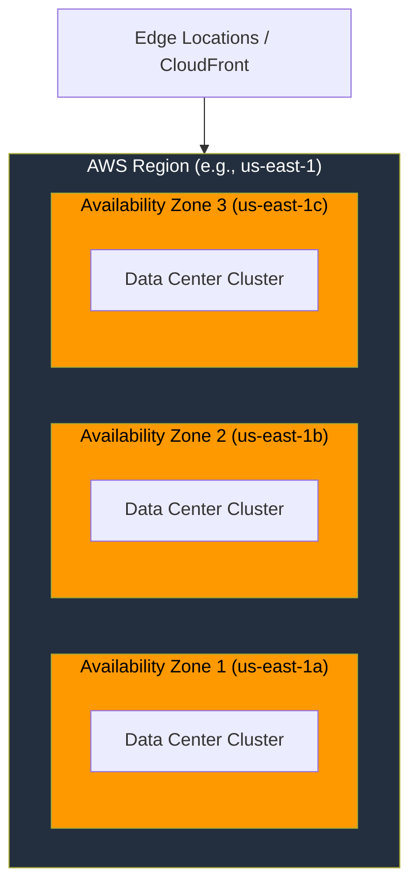
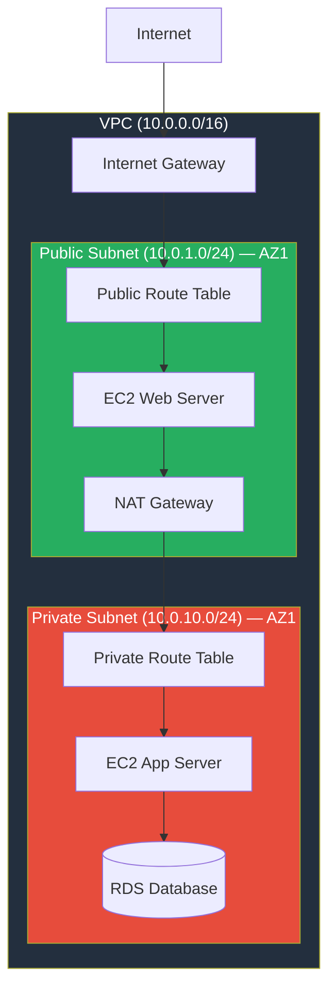
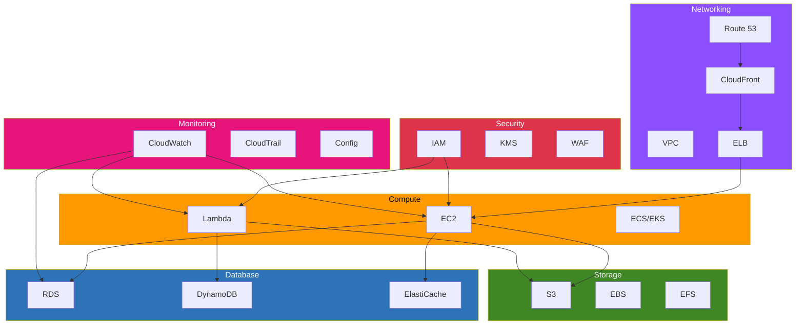

# AWS Core Services Overview

A practical overview of the most essential AWS services, when to use them, and how they fit together.

---

## Table of Contents

- [AWS Global Infrastructure](#aws-global-infrastructure)
- [Compute — EC2](#compute--ec2)
- [Storage — S3](#storage--s3)
- [Networking — VPC](#networking--vpc)
- [Identity — IAM](#identity--iam)
- [DNS — Route 53](#dns--route-53)
- [Monitoring — CloudWatch](#monitoring--cloudwatch)
- [Serverless — Lambda](#serverless--lambda)
- [Load Balancing — ELB](#load-balancing--elb)
- [Service Map](#service-map)

---

## AWS Global Infrastructure



| Concept | Description |
|---------|-------------|
| **Region** | Geographic area with multiple data centers (e.g., `us-east-1`, `eu-west-1`) |
| **Availability Zone (AZ)** | One or more isolated data centers within a region |
| **Edge Location** | CDN endpoints for CloudFront, closer to end users |

**Best practice:** Deploy across multiple AZs for high availability.

---

## Compute — EC2

Elastic Compute Cloud — virtual servers in the cloud.

### Key Concepts

| Concept | Description |
|---------|-------------|
| **Instance** | A virtual server |
| **AMI** | Amazon Machine Image — template for instances |
| **Instance Type** | CPU, memory, storage configuration (e.g., `t3.micro`, `m5.xlarge`) |
| **Security Group** | Virtual firewall controlling inbound/outbound traffic |
| **Key Pair** | SSH key for instance access |
| **EBS** | Elastic Block Store — persistent block storage volumes |

### Instance Type Categories

| Category | Use Case | Example |
|----------|----------|---------|
| **t3/t4g** | General purpose, burstable | Web servers, dev/test |
| **m5/m6i** | General purpose, steady | Application servers |
| **c5/c6i** | Compute optimized | Batch processing, ML inference |
| **r5/r6i** | Memory optimized | Databases, in-memory caching |
| **i3/i4i** | Storage optimized | Data warehouses, distributed filesystems |

### Common Operations

```bash
# Launch instance
aws ec2 run-instances \
  --image-id ami-0c55b159cbfafe1f0 \
  --instance-type t3.micro \
  --key-name my-key \
  --security-group-ids sg-12345678 \
  --subnet-id subnet-12345678

# List instances
aws ec2 describe-instances \
  --filters "Name=instance-state-name,Values=running" \
  --query 'Reservations[*].Instances[*].[InstanceId,InstanceType,PublicIpAddress,Tags[?Key==`Name`].Value|[0]]' \
  --output table

# Stop / Start / Terminate
aws ec2 stop-instances --instance-ids i-1234567890abcdef0
aws ec2 start-instances --instance-ids i-1234567890abcdef0
aws ec2 terminate-instances --instance-ids i-1234567890abcdef0
```

---

## Storage — S3

Simple Storage Service — object storage with virtually unlimited capacity.

### Key Concepts

| Concept | Description |
|---------|-------------|
| **Bucket** | Container for objects (globally unique name) |
| **Object** | File + metadata (key-value) |
| **Key** | Unique identifier for an object within a bucket |
| **Storage Class** | Pricing tier based on access frequency |

### Storage Classes

| Class | Use Case | Availability |
|-------|----------|-------------|
| **Standard** | Frequently accessed data | 99.99% |
| **Intelligent-Tiering** | Unknown/changing access patterns | 99.9% |
| **Standard-IA** | Infrequently accessed, rapid retrieval | 99.9% |
| **Glacier Instant** | Archive with millisecond retrieval | 99.9% |
| **Glacier Flexible** | Archive, minutes to hours retrieval | 99.99% |
| **Glacier Deep Archive** | Long-term archive, 12-hour retrieval | 99.99% |

### Common Operations

```bash
# Create bucket
aws s3 mb s3://my-bucket-name

# Upload file
aws s3 cp file.txt s3://my-bucket/path/

# Sync directory
aws s3 sync ./local-dir/ s3://my-bucket/prefix/

# List objects
aws s3 ls s3://my-bucket/path/

# Download file
aws s3 cp s3://my-bucket/path/file.txt ./

# Enable versioning
aws s3api put-bucket-versioning \
  --bucket my-bucket \
  --versioning-configuration Status=Enabled
```

---

## Networking — VPC

Virtual Private Cloud — isolated network environment in AWS.

### Architecture



| Component | Description |
|-----------|-------------|
| **VPC** | Isolated virtual network (define CIDR block) |
| **Subnet** | Segment of VPC within one AZ (public or private) |
| **Internet Gateway** | Connects VPC to the internet |
| **NAT Gateway** | Lets private subnet resources access internet (outbound only) |
| **Route Table** | Controls traffic routing between subnets |
| **Security Group** | Stateful firewall at instance level |
| **NACL** | Stateless firewall at subnet level |

---

## Identity — IAM

Identity and Access Management — controls who can do what in your AWS account.

### Key Concepts

| Concept | Description |
|---------|-------------|
| **User** | Individual identity with credentials |
| **Group** | Collection of users with shared permissions |
| **Role** | Identity for services/applications (no credentials) |
| **Policy** | JSON document defining permissions |

### Policy Example

```json
{
  "Version": "2012-10-17",
  "Statement": [
    {
      "Effect": "Allow",
      "Action": [
        "s3:GetObject",
        "s3:PutObject"
      ],
      "Resource": "arn:aws:s3:::my-bucket/*"
    },
    {
      "Effect": "Deny",
      "Action": "s3:DeleteBucket",
      "Resource": "*"
    }
  ]
}
```

### IAM Best Practices

1. **Enable MFA** on all accounts, especially root
2. **Use roles** for applications instead of access keys
3. **Follow least privilege** — grant only what's needed
4. **Use groups** to assign permissions (not individual users)
5. **Rotate credentials** regularly
6. **Never use the root account** for daily tasks
7. **Use IAM Access Analyzer** to identify unused permissions

---

## DNS — Route 53

Scalable DNS and domain registration service.

### Routing Policies

| Policy | Use Case |
|--------|----------|
| **Simple** | Single resource for a domain |
| **Weighted** | Distribute traffic by percentage |
| **Latency-based** | Route to lowest latency region |
| **Failover** | Active-passive failover |
| **Geolocation** | Route based on user location |
| **Multi-value** | Return multiple healthy records |

---

## Monitoring — CloudWatch

Monitoring and observability service for AWS resources.

| Feature | Description |
|---------|-------------|
| **Metrics** | CPU, memory, network, custom metrics |
| **Alarms** | Trigger actions based on metric thresholds |
| **Logs** | Centralized log collection and analysis |
| **Dashboards** | Custom visualization of metrics |
| **Events/EventBridge** | React to AWS resource changes |

```bash
# Get CPU utilization for an EC2 instance
aws cloudwatch get-metric-statistics \
  --namespace AWS/EC2 \
  --metric-name CPUUtilization \
  --dimensions Name=InstanceId,Value=i-1234567890abcdef0 \
  --start-time 2024-01-01T00:00:00Z \
  --end-time 2024-01-02T00:00:00Z \
  --period 3600 \
  --statistics Average

# Create alarm
aws cloudwatch put-metric-alarm \
  --alarm-name "High-CPU" \
  --metric-name CPUUtilization \
  --namespace AWS/EC2 \
  --statistic Average \
  --period 300 \
  --threshold 80 \
  --comparison-operator GreaterThanThreshold \
  --evaluation-periods 2
```

---

## Serverless — Lambda

Run code without provisioning servers. Pay only for compute time consumed.

| Feature | Detail |
|---------|--------|
| **Runtime** | Python, Node.js, Java, Go, .NET, Ruby, custom |
| **Timeout** | Max 15 minutes |
| **Memory** | 128 MB – 10,240 MB |
| **Triggers** | API Gateway, S3, SQS, CloudWatch Events, etc. |

```python
# Example Lambda function (Python)
import json

def lambda_handler(event, context):
    """Process incoming API Gateway request."""
    name = event.get("queryStringParameters", {}).get("name", "World")

    return {
        "statusCode": 200,
        "headers": {"Content-Type": "application/json"},
        "body": json.dumps({
            "message": f"Hello, {name}!",
            "event": event,
        }),
    }
```

---

## Load Balancing — ELB

Elastic Load Balancing distributes incoming traffic across multiple targets.

| Type | Layer | Use Case |
|------|-------|----------|
| **Application LB (ALB)** | Layer 7 (HTTP/S) | Web apps, microservices, path-based routing |
| **Network LB (NLB)** | Layer 4 (TCP/UDP) | Ultra-low latency, static IPs |
| **Gateway LB (GWLB)** | Layer 3 | Third-party virtual appliances |

---

## Service Map



---

[← Back to AWS](README.md)
