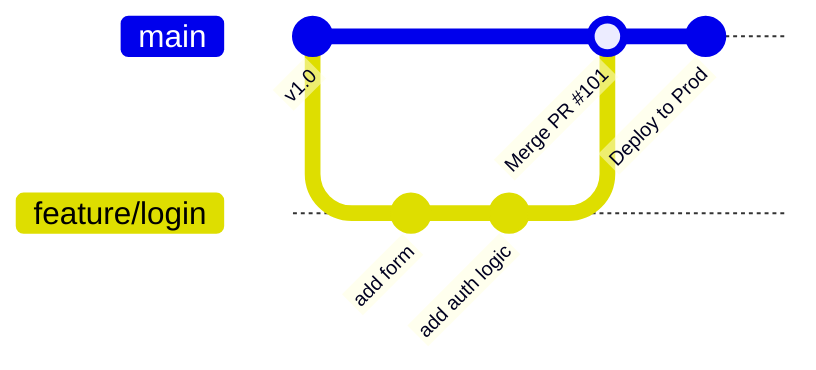
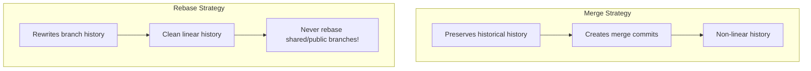

# Essential Git Workflows

Practical strategies and workflows for Git version control in software engineering teams.

---

## Table of Contents

- [Branching Strategies](#branching-strategies)
- [Merge vs Rebase](#merge-vs-rebase)
- [Interactive Rebase](#interactive-rebase)
- [Stashing Changes](#stashing-changes)
- [Cherry-Pick](#cherry-pick)
- [Git Bisect for Bug Hunting](#git-bisect-for-bug-hunting)
- [Recovering Lost Commits (Reflog)](#recovering-lost-commits-reflog)

---

## Branching Strategies

### GitHub Flow (Recommended for CI/CD)



1. **`main` is always deployable.**
2. Create descriptive feature branches from `main` (`feat/add-auth`, `fix/login-bug`).
3. Open a Pull Request early for discussion and review.
4. Merge into `main` after CI checks pass and code is approved.

---

## Merge vs Rebase



### When to Use What

- **Use `git rebase`** to update your local feature branch with the latest `main` before opening a PR:
  ```bash
  git checkout feat/my-feature
  git fetch origin
  git rebase origin/main
  ```
- **Use `git merge --no-ff`** when merging a PR into `main` to preserve team context.

---

## Interactive Rebase

Clean up your local commits before pushing to remote:

```bash
# Rebase the last 4 commits interactively
git rebase -i HEAD~4
```

### Rebase Commands

| Command | Action |
|---------|--------|
| `pick` | Use commit as-is |
| `reword` | Edit commit message |
| `edit` | Stop to modify commit content |
| `squash` | Combine into previous commit and combine messages |
| `fixup` | Combine into previous commit, discarding message |
| `drop` | Remove commit completely |

---

## Stashing Changes

Temporarily shelve uncommitted work without committing:

```bash
# Save uncommitted changes
git stash save "Work in progress on login component"

# Include untracked files
git stash -u

# List all stashes
git stash list

# Apply most recent stash and remove it from list
git stash pop

# Apply specific stash without removing it
git stash apply stash@{2}

# Drop specific stash
git stash drop stash@{0}
```

---

## Cherry-Pick

Apply a specific commit from one branch onto another:

```bash
# Apply commit ABC1234 onto current branch
git cherry-pick ABC1234

# Cherry-pick multiple commits
git cherry-pick ABC1234 DEF5678
```

**Use Case:** Backporting a urgent hotfix from `main` to a release branch without merging the whole branch.

---

## Git Bisect for Bug Hunting

Find the exact commit that introduced a bug using binary search:

```bash
# 1. Start bisect
git bisect start

# 2. Mark current bad commit
git bisect bad

# 3. Mark a known good commit in history
git bisect good v1.0.0

# 4. Git will checkout mid-points. Test each step and mark:
git bisect good   # if working
git bisect bad    # if broken

# 5. Git pinpoints bad commit. Reset when done:
git bisect reset
```

---

## Recovering Lost Commits (Reflog)

Git keeps track of every HEAD reference update in the `reflog`:

```bash
# View reference log
git reflog

# Outputs:
# e3f12a9 HEAD@{0}: reset: moving to HEAD~1
# a7b8c9d HEAD@{1}: commit: add payment endpoint

# Recover accidentally deleted branch or reset commit:
git checkout -b recovery-branch a7b8c9d
```

---

[← Back to Git](README.md)
