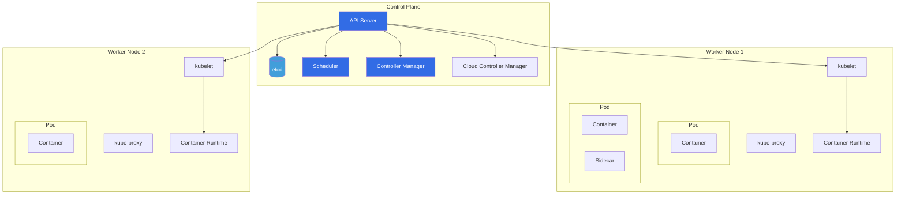
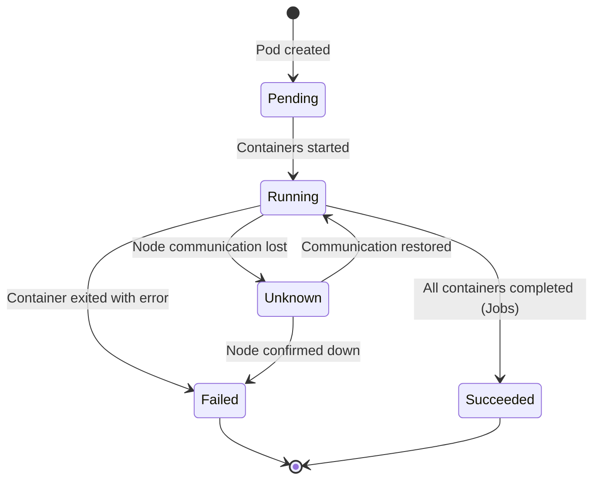
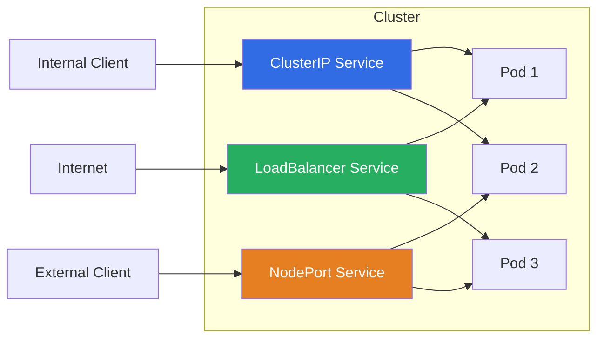

# Kubernetes Core Concepts

A practical guide to the fundamental building blocks of Kubernetes, with architecture diagrams and ready-to-use YAML manifests.

---

## Table of Contents

- [Cluster Architecture](#cluster-architecture)
- [Pods](#pods)
- [Deployments](#deployments)
- [Services](#services)
- [ConfigMaps](#configmaps)
- [Secrets](#secrets)
- [Namespaces](#namespaces)
- [Resource Management](#resource-management)
- [Useful kubectl Commands](#useful-kubectl-commands)

---

## Cluster Architecture



### Component Roles

| Component | Role |
|-----------|------|
| **API Server** | Front door to the cluster — all communication goes through it |
| **etcd** | Distributed key-value store holding all cluster state |
| **Scheduler** | Assigns pods to nodes based on resource requirements |
| **Controller Manager** | Runs controllers (Deployment, ReplicaSet, Node, etc.) |
| **kubelet** | Agent on each node that manages pod lifecycle |
| **kube-proxy** | Maintains network rules for service routing |
| **Container Runtime** | Runs containers (containerd, CRI-O) |

---

## Pods

A Pod is the smallest deployable unit in Kubernetes — one or more containers sharing network and storage.

### Basic Pod

```yaml
apiVersion: v1
kind: Pod
metadata:
  name: nginx-pod
  labels:
    app: nginx
    environment: dev
spec:
  containers:
    - name: nginx
      image: nginx:1.25-alpine
      ports:
        - containerPort: 80
      resources:
        requests:
          cpu: "100m"
          memory: "128Mi"
        limits:
          cpu: "250m"
          memory: "256Mi"
      livenessProbe:
        httpGet:
          path: /
          port: 80
        initialDelaySeconds: 10
        periodSeconds: 15
      readinessProbe:
        httpGet:
          path: /
          port: 80
        initialDelaySeconds: 5
        periodSeconds: 5
```

### Multi-Container Pod (Sidecar Pattern)

```yaml
apiVersion: v1
kind: Pod
metadata:
  name: app-with-logging
spec:
  containers:
    # Main application container
    - name: app
      image: myapp:1.0
      ports:
        - containerPort: 8080
      volumeMounts:
        - name: log-volume
          mountPath: /var/log/app

    # Sidecar: log shipper
    - name: log-shipper
      image: fluentd:latest
      volumeMounts:
        - name: log-volume
          mountPath: /var/log/app
          readOnly: true

  volumes:
    - name: log-volume
      emptyDir: {}
```

### Pod Lifecycle



---

## Deployments

Deployments manage ReplicaSets and provide declarative updates, rollbacks, and scaling.

### Production Deployment

```yaml
apiVersion: apps/v1
kind: Deployment
metadata:
  name: web-app
  labels:
    app: web-app
spec:
  replicas: 3
  selector:
    matchLabels:
      app: web-app
  strategy:
    type: RollingUpdate
    rollingUpdate:
      maxSurge: 1          # Max pods above desired count during update
      maxUnavailable: 0     # Zero downtime — always keep all replicas running
  template:
    metadata:
      labels:
        app: web-app
        version: "1.0"
    spec:
      containers:
        - name: web-app
          image: myapp:1.0
          ports:
            - containerPort: 8080
          env:
            - name: LOG_LEVEL
              value: "info"
            - name: DB_HOST
              valueFrom:
                configMapKeyRef:
                  name: app-config
                  key: db_host
            - name: DB_PASSWORD
              valueFrom:
                secretKeyRef:
                  name: app-secrets
                  key: db_password
          resources:
            requests:
              cpu: "200m"
              memory: "256Mi"
            limits:
              cpu: "500m"
              memory: "512Mi"
          livenessProbe:
            httpGet:
              path: /health
              port: 8080
            initialDelaySeconds: 15
            periodSeconds: 20
            failureThreshold: 3
          readinessProbe:
            httpGet:
              path: /ready
              port: 8080
            initialDelaySeconds: 5
            periodSeconds: 10
      restartPolicy: Always
```

### Common Deployment Operations

```bash
# Create / apply deployment
kubectl apply -f deployment.yaml

# Check rollout status
kubectl rollout status deployment/web-app

# View rollout history
kubectl rollout history deployment/web-app

# Rollback to previous version
kubectl rollout undo deployment/web-app

# Rollback to specific revision
kubectl rollout undo deployment/web-app --to-revision=2

# Scale deployment
kubectl scale deployment/web-app --replicas=5

# Update image (triggers rolling update)
kubectl set image deployment/web-app web-app=myapp:2.0

# Pause / resume rollout
kubectl rollout pause deployment/web-app
kubectl rollout resume deployment/web-app
```

---

## Services

Services provide stable networking for pods — a fixed IP and DNS name regardless of pod lifecycle.

### Service Types



### ClusterIP (Default — Internal Only)

```yaml
apiVersion: v1
kind: Service
metadata:
  name: web-app-service
spec:
  type: ClusterIP
  selector:
    app: web-app
  ports:
    - port: 80           # Service port
      targetPort: 8080    # Container port
      protocol: TCP
```

### NodePort (External via Node IP)

```yaml
apiVersion: v1
kind: Service
metadata:
  name: web-app-nodeport
spec:
  type: NodePort
  selector:
    app: web-app
  ports:
    - port: 80
      targetPort: 8080
      nodePort: 30080     # Accessible on <NodeIP>:30080
```

### LoadBalancer (Cloud Provider)

```yaml
apiVersion: v1
kind: Service
metadata:
  name: web-app-lb
spec:
  type: LoadBalancer
  selector:
    app: web-app
  ports:
    - port: 80
      targetPort: 8080
```

| Type | Access | Use Case |
|------|--------|----------|
| **ClusterIP** | Internal only | Service-to-service communication |
| **NodePort** | External via node port (30000–32767) | Development, testing |
| **LoadBalancer** | External via cloud LB | Production internet-facing |
| **ExternalName** | DNS CNAME | Alias for external services |

---

## ConfigMaps

ConfigMaps store non-sensitive configuration data as key-value pairs.

```yaml
apiVersion: v1
kind: ConfigMap
metadata:
  name: app-config
data:
  # Simple key-value pairs
  db_host: "postgres.default.svc.cluster.local"
  db_port: "5432"
  log_level: "info"

  # Entire config file
  app.conf: |
    [server]
    host = 0.0.0.0
    port = 8080
    workers = 4

    [database]
    pool_size = 10
    timeout = 30
```

### Using ConfigMaps in Pods

```yaml
# As environment variables
env:
  - name: DB_HOST
    valueFrom:
      configMapKeyRef:
        name: app-config
        key: db_host

# All keys as environment variables
envFrom:
  - configMapRef:
      name: app-config

# As a mounted volume (file)
volumeMounts:
  - name: config-volume
    mountPath: /etc/app/
volumes:
  - name: config-volume
    configMap:
      name: app-config
```

---

## Secrets

Secrets store sensitive data (passwords, tokens, keys). Values are base64-encoded (not encrypted at rest by default).

```yaml
apiVersion: v1
kind: Secret
metadata:
  name: app-secrets
type: Opaque
data:
  # Values must be base64-encoded
  # echo -n 'mypassword' | base64
  db_password: bXlwYXNzd29yZA==
  api_key: c3VwZXJzZWNyZXRrZXk=
```

### Creating Secrets from CLI

```bash
# From literal values
kubectl create secret generic app-secrets \
  --from-literal=db_password=mypassword \
  --from-literal=api_key=supersecretkey

# From file
kubectl create secret generic tls-cert \
  --from-file=cert.pem \
  --from-file=key.pem

# View decoded secret
kubectl get secret app-secrets -o jsonpath='{.data.db_password}' | base64 -d
```

### Using Secrets in Pods

```yaml
env:
  - name: DB_PASSWORD
    valueFrom:
      secretKeyRef:
        name: app-secrets
        key: db_password

# As mounted files
volumeMounts:
  - name: secret-volume
    mountPath: /etc/secrets/
    readOnly: true
volumes:
  - name: secret-volume
    secret:
      secretName: app-secrets
```

> ⚠️ **Security Note:** Kubernetes Secrets are base64-encoded, not encrypted. For production, use:
> - **Sealed Secrets** (Bitnami)
> - **External Secrets Operator** (with AWS Secrets Manager, HashiCorp Vault, etc.)
> - **SOPS** for encrypting secret manifests in Git

---

## Namespaces

Namespaces provide logical isolation within a cluster.

```bash
# List namespaces
kubectl get namespaces

# Create namespace
kubectl create namespace staging

# Set default namespace for context
kubectl config set-context --current --namespace=staging

# Deploy to specific namespace
kubectl apply -f deployment.yaml -n staging

# Get resources in all namespaces
kubectl get pods --all-namespaces
kubectl get pods -A   # shorthand
```

### Namespace YAML

```yaml
apiVersion: v1
kind: Namespace
metadata:
  name: production
  labels:
    environment: production
    team: platform
```

### Default Namespaces

| Namespace | Purpose |
|-----------|---------|
| `default` | Resources with no namespace specified |
| `kube-system` | Kubernetes system components |
| `kube-public` | Publicly accessible resources |
| `kube-node-lease` | Node heartbeat leases |

---

## Resource Management

### Requests and Limits

```yaml
resources:
  requests:           # Minimum guaranteed resources
    cpu: "250m"       # 250 millicores = 0.25 CPU
    memory: "256Mi"   # 256 mebibytes
  limits:             # Maximum allowed resources
    cpu: "500m"       # Container throttled above this
    memory: "512Mi"   # Container OOMKilled above this
```

| Unit | Meaning | Example |
|------|---------|---------|
| `m` | Millicores (CPU) | `500m` = 0.5 CPU |
| `Mi` | Mebibytes (Memory) | `256Mi` = ~268 MB |
| `Gi` | Gibibytes (Memory) | `1Gi` = ~1.07 GB |

**Best practice:** Always set `requests`. Set `limits` for memory (OOM protection). Be cautious with CPU limits (causes throttling).

---

## Useful kubectl Commands

### Resource Inspection

```bash
# Get resources with wide output
kubectl get pods -o wide
kubectl get deployments
kubectl get services
kubectl get all

# Describe resource (events, conditions, config)
kubectl describe pod <pod-name>
kubectl describe deployment <deployment-name>

# View YAML of running resource
kubectl get pod <pod-name> -o yaml

# View logs
kubectl logs <pod-name>
kubectl logs <pod-name> -c <container-name>   # multi-container pod
kubectl logs -f <pod-name>                      # follow
kubectl logs --previous <pod-name>              # previous crash

# Execute command in pod
kubectl exec -it <pod-name> -- /bin/sh
kubectl exec -it <pod-name> -- env
```

### Troubleshooting

```bash
# Why is my pod not running?
kubectl describe pod <pod-name>    # Check Events section
kubectl get events --sort-by='.lastTimestamp'

# Resource usage
kubectl top nodes
kubectl top pods

# Debug with ephemeral container
kubectl debug -it <pod-name> --image=busybox
```

---

[← Back to Kubernetes](README.md)
