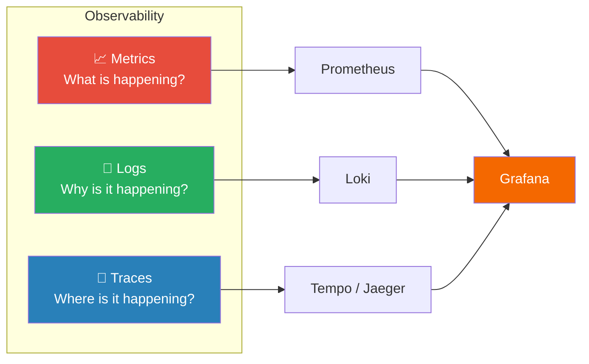
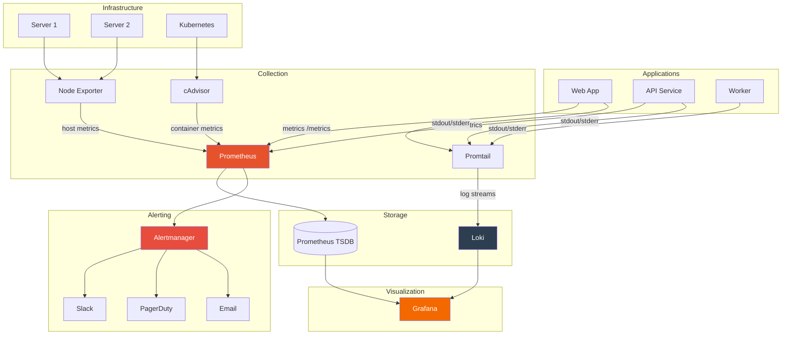

# Observability Fundamentals

Understanding the three pillars of observability, modern monitoring architecture, and alerting strategies for production systems.

---

## Table of Contents

- [What is Observability?](#what-is-observability)
- [The Three Pillars](#the-three-pillars)
- [Monitoring Architecture](#monitoring-architecture)
- [Prometheus — Metrics](#prometheus--metrics)
- [Grafana — Visualization](#grafana--visualization)
- [Loki — Logs](#loki--logs)
- [Alerting Strategy](#alerting-strategy)
- [SLOs, SLIs, and Error Budgets](#slos-slis-and-error-budgets)
- [Best Practices](#best-practices)

---

## What is Observability?

Observability is the ability to understand the internal state of a system by examining its external outputs. Unlike traditional monitoring (which checks known failure modes), observability lets you ask arbitrary questions about your system.

**Monitoring tells you *when* something is broken. Observability helps you understand *why*.**

---

## The Three Pillars



### Metrics

**Numeric measurements over time** — CPU usage, request count, error rate, latency.

- **Best for:** Dashboards, alerting, trend analysis, capacity planning
- **Tools:** Prometheus, Datadog, CloudWatch, InfluxDB
- **Storage:** Time-series databases (TSDB)
- **Example:** `http_requests_total{method="GET", status="200"} 15234`

### Logs

**Timestamped, structured or unstructured text records** of discrete events.

- **Best for:** Debugging, audit trails, error investigation
- **Tools:** Loki, Elasticsearch (ELK), Splunk, CloudWatch Logs
- **Storage:** Log aggregation systems
- **Example:** `2024-07-20T10:30:45Z [ERROR] Failed to connect to database: connection refused`

### Traces

**End-to-end request paths through distributed systems** showing timing of each component.

- **Best for:** Identifying bottlenecks in microservices, understanding request flow
- **Tools:** Jaeger, Tempo, Zipkin, X-Ray
- **Storage:** Trace backends
- **Example:** Request → API Gateway (5ms) → Auth Service (12ms) → Database (45ms) → Response

---

## Monitoring Architecture



---

## Prometheus — Metrics

Prometheus is an open-source metrics collection and alerting toolkit.

### How It Works

1. **Pull model** — Prometheus scrapes `/metrics` endpoints at configured intervals
2. **Time-series storage** — data stored as metric name + labels + timestamp + value
3. **PromQL** — powerful query language for analysis and alerting

### Metric Types

| Type | Description | Example |
|------|-------------|---------|
| **Counter** | Monotonically increasing value | `http_requests_total` |
| **Gauge** | Value that goes up and down | `cpu_temperature_celsius` |
| **Histogram** | Observations in buckets | `http_request_duration_seconds` |
| **Summary** | Similar to histogram, with quantiles | `rpc_duration_seconds` |

### PromQL Examples

```promql
# Request rate (per second) over 5 minutes
rate(http_requests_total[5m])

# Error rate percentage
rate(http_requests_total{status=~"5.."}[5m])
/ rate(http_requests_total[5m]) * 100

# 95th percentile latency
histogram_quantile(0.95, rate(http_request_duration_seconds_bucket[5m]))

# CPU usage percentage
100 - (avg by(instance) (rate(node_cpu_seconds_total{mode="idle"}[5m])) * 100)

# Memory usage percentage
(1 - node_memory_MemAvailable_bytes / node_memory_MemTotal_bytes) * 100

# Disk usage percentage
(1 - node_filesystem_avail_bytes / node_filesystem_size_bytes) * 100

# Top 5 pods by CPU usage
topk(5, rate(container_cpu_usage_seconds_total[5m]))
```

---

## Grafana — Visualization

Grafana is the standard for metrics visualization and dashboarding.

### Key Features

| Feature | Description |
|---------|-------------|
| **Dashboards** | Customizable panels with graphs, gauges, tables, heatmaps |
| **Data Sources** | Prometheus, Loki, Elasticsearch, CloudWatch, PostgreSQL, etc. |
| **Alerting** | Visual alert rule editor with multiple notification channels |
| **Variables** | Template dashboards with dropdown filters |
| **Annotations** | Mark events (deployments, incidents) on graphs |

### Dashboard Best Practices

1. **USE method for infrastructure:** Utilization, Saturation, Errors
2. **RED method for services:** Rate, Errors, Duration
3. **Top-to-bottom flow:** Overview → service health → detailed metrics
4. **Consistent time ranges** across panels
5. **Use variables** for environment, service, and instance filtering

---

## Loki — Logs

Loki is a horizontally scalable, cost-effective log aggregation system designed to work with Grafana.

### Key Concepts

| Concept | Description |
|---------|-------------|
| **Promtail** | Agent that ships logs to Loki |
| **Labels** | Metadata for log streams (like Prometheus labels) |
| **LogQL** | Query language for Loki (inspired by PromQL) |
| **Chunks** | Compressed log data storage |

### LogQL Examples

```logql
# Find all error logs for a specific app
{app="web-api"} |= "error"

# Parse JSON logs and filter
{app="web-api"} | json | status >= 500

# Count errors per minute
count_over_time({app="web-api"} |= "error" [1m])

# Top error messages
{app="web-api"} |= "error" | pattern `<_> error: <message>` | topk(10, message)
```

---

## Alerting Strategy

### Alert Severity Levels

| Severity | Response Time | Examples | Notification |
|----------|--------------|---------|-------------|
| **Critical (P1)** | Immediate | Service down, data loss risk | PagerDuty, Phone |
| **Warning (P2)** | Within 1 hour | High error rate, degraded performance | Slack, Email |
| **Info (P3)** | Next business day | Disk approaching 80%, certificate expiring | Slack |

### Example Prometheus Alert Rules

```yaml
groups:
  - name: application
    rules:
      - alert: HighErrorRate
        expr: |
          rate(http_requests_total{status=~"5.."}[5m])
          / rate(http_requests_total[5m]) > 0.05
        for: 5m
        labels:
          severity: warning
        annotations:
          summary: "High error rate on {{ $labels.instance }}"
          description: "Error rate is {{ $value | humanizePercentage }} (threshold: 5%)"

      - alert: ServiceDown
        expr: up == 0
        for: 1m
        labels:
          severity: critical
        annotations:
          summary: "Service {{ $labels.job }} is down"
          description: "{{ $labels.instance }} has been unreachable for 1 minute"

  - name: infrastructure
    rules:
      - alert: HighCPUUsage
        expr: |
          100 - (avg by(instance) (rate(node_cpu_seconds_total{mode="idle"}[5m])) * 100) > 85
        for: 10m
        labels:
          severity: warning
        annotations:
          summary: "High CPU usage on {{ $labels.instance }}"

      - alert: DiskSpaceLow
        expr: |
          (1 - node_filesystem_avail_bytes{mountpoint="/"} / node_filesystem_size_bytes{mountpoint="/"}) * 100 > 85
        for: 5m
        labels:
          severity: warning
        annotations:
          summary: "Disk space low on {{ $labels.instance }}"
```

---

## SLOs, SLIs, and Error Budgets

### Definitions

| Term | Definition | Example |
|------|-----------|---------|
| **SLI** (Service Level Indicator) | Metric that measures service quality | Request latency p99 < 200ms |
| **SLO** (Service Level Objective) | Target value for an SLI | 99.9% of requests under 200ms |
| **SLA** (Service Level Agreement) | Business contract based on SLOs | 99.9% uptime or credits issued |
| **Error Budget** | Allowed failure margin | 0.1% = ~43 min downtime/month |

### Error Budget Calculation

```
Monthly error budget for 99.9% availability:

Total minutes in month: 30 × 24 × 60 = 43,200 minutes
Error budget: 43,200 × 0.001 = 43.2 minutes of downtime

If you've used 30 minutes already → 13.2 minutes remaining
If budget is exhausted → freeze deployments, focus on reliability
```

---

## Best Practices

1. **Monitor the four golden signals:** Latency, Traffic, Errors, Saturation
2. **Alert on symptoms, not causes** — alert on "high error rate" not "high CPU"
3. **Avoid alert fatigue** — every alert should be actionable
4. **Use runbooks** — link alerts to troubleshooting procedures
5. **Instrument your code** — expose custom metrics via `/metrics` endpoint
6. **Centralize logs** — don't SSH into servers to read log files
7. **Correlate signals** — use Grafana to view metrics and logs side-by-side
8. **Test your monitoring** — chaos engineering, fire drills
9. **Automate dashboards** — provision via code (Grafana provisioning, Terraform)
10. **Review regularly** — remove stale alerts, update thresholds

---

[← Back to Monitoring](README.md)
