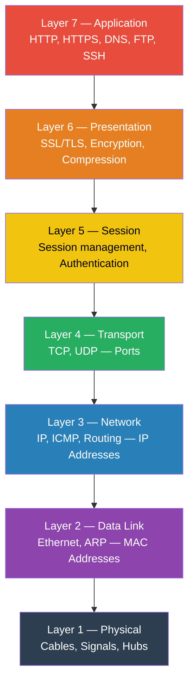
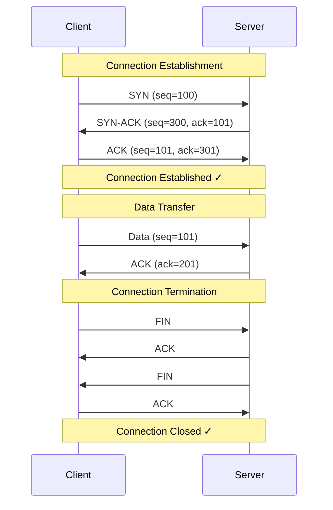
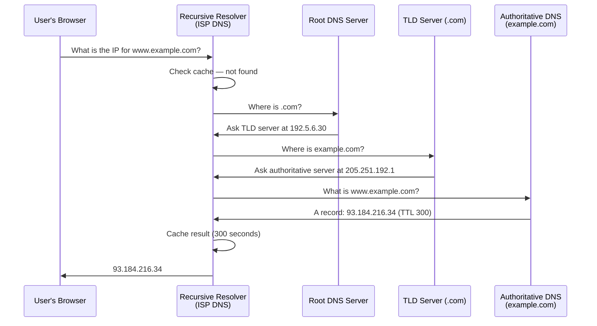
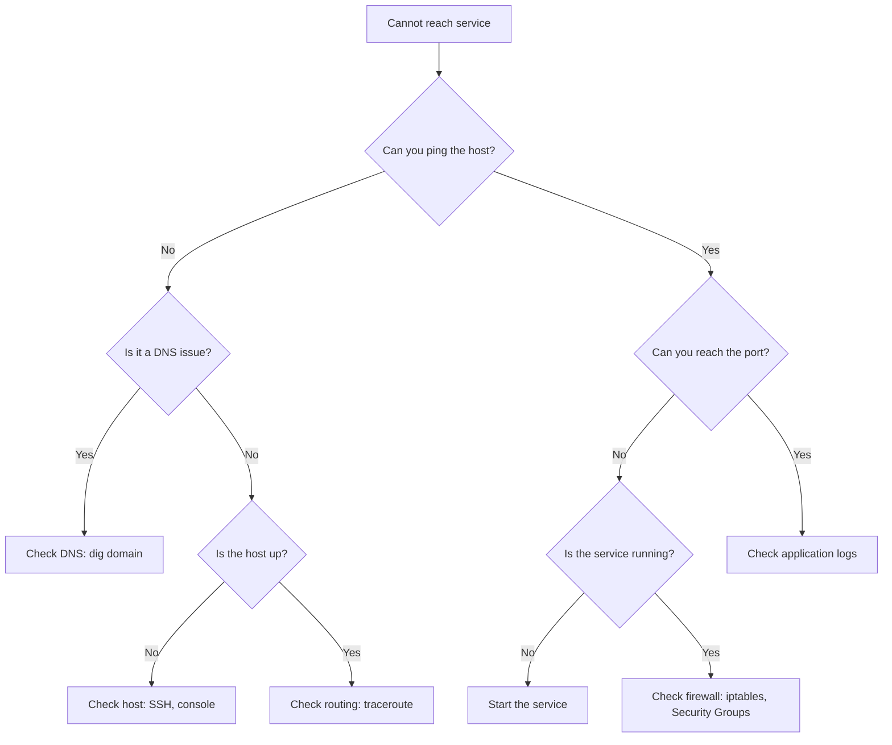

# TCP/IP Fundamentals

A practical guide to the networking stack every DevOps engineer needs to understand — OSI model, TCP vs UDP, DNS resolution, common ports, and troubleshooting.

---

## Table of Contents

- [The OSI Model](#the-osi-model)
- [TCP/IP Model](#tcpip-model)
- [TCP vs UDP](#tcp-vs-udp)
- [TCP Three-Way Handshake](#tcp-three-way-handshake)
- [Common Ports](#common-ports)
- [DNS Resolution](#dns-resolution)
- [IP Addressing and Subnetting](#ip-addressing-and-subnetting)
- [Network Troubleshooting Tools](#network-troubleshooting-tools)

---

## The OSI Model

The Open Systems Interconnection model describes networking in seven layers:



### What Happens at Each Layer

| Layer | Data Unit | Devices | DevOps Relevance |
|-------|-----------|---------|-----------------|
| 7 Application | Data | — | HTTP APIs, DNS records, SSH access |
| 6 Presentation | Data | — | TLS certificates, data encoding |
| 5 Session | Data | — | Connection persistence |
| 4 Transport | Segment | — | Port numbers, TCP/UDP, firewalls |
| 3 Network | Packet | Routers | IP addressing, routing, VPCs |
| 2 Data Link | Frame | Switches | MAC addresses, VLANs |
| 1 Physical | Bits | Cables, Hubs | Physical connectivity |

**Mnemonic (top→bottom):** All People Seem To Need Data Processing

---

## TCP/IP Model

The practical networking model used by the internet maps to the OSI model:

| TCP/IP Layer | OSI Layers | Protocols |
|-------------|-----------|-----------|
| Application | 7, 6, 5 | HTTP, HTTPS, DNS, SSH, FTP, SMTP |
| Transport | 4 | TCP, UDP |
| Internet | 3 | IP, ICMP, ARP |
| Network Access | 2, 1 | Ethernet, Wi-Fi |

---

## TCP vs UDP

### TCP (Transmission Control Protocol)

- **Connection-oriented** — establishes connection before data transfer
- **Reliable** — guarantees delivery, ordering, and error checking
- **Slower** — overhead from handshake, acknowledgments, retransmission
- **Use cases:** Web (HTTP/S), email (SMTP), file transfer (FTP), SSH

### UDP (User Datagram Protocol)

- **Connectionless** — no handshake required
- **Unreliable** — no delivery guarantee, no ordering
- **Faster** — minimal overhead
- **Use cases:** DNS lookups, video streaming, gaming, VoIP, monitoring (StatsD)

### Comparison

| Feature | TCP | UDP |
|---------|-----|-----|
| Connection | Connection-oriented | Connectionless |
| Reliability | Guaranteed delivery | Best-effort |
| Ordering | In-order delivery | No ordering |
| Speed | Slower (overhead) | Faster (minimal overhead) |
| Header size | 20+ bytes | 8 bytes |
| Flow control | Yes (sliding window) | No |
| Use case | Web, SSH, email | DNS, streaming, gaming |

---

## TCP Three-Way Handshake



### Steps Explained

1. **SYN** — Client sends synchronization request with initial sequence number
2. **SYN-ACK** — Server acknowledges and sends its own sequence number
3. **ACK** — Client acknowledges server's sequence number

**Why three-way?** Both sides need to agree on initial sequence numbers for reliable, ordered communication.

---

## Common Ports

### Well-Known Ports (0–1023)

| Port | Protocol | Service | Description |
|------|----------|---------|-------------|
| 20 | TCP | FTP Data | File transfer (data channel) |
| 21 | TCP | FTP Control | File transfer (control channel) |
| 22 | TCP | SSH | Secure shell, SCP, SFTP |
| 25 | TCP | SMTP | Email sending |
| 53 | TCP/UDP | DNS | Domain name resolution |
| 80 | TCP | HTTP | Web traffic (unencrypted) |
| 110 | TCP | POP3 | Email retrieval |
| 143 | TCP | IMAP | Email retrieval |
| 443 | TCP | HTTPS | Web traffic (encrypted) |

### DevOps-Relevant Ports

| Port | Service | Description |
|------|---------|-------------|
| 2379-2380 | etcd | Kubernetes cluster state |
| 3000 | Grafana | Dashboard UI (default) |
| 3306 | MySQL | Database |
| 5432 | PostgreSQL | Database |
| 5672 | RabbitMQ | Message broker |
| 6379 | Redis | In-memory data store |
| 6443 | Kubernetes API | K8s API server |
| 8080 | HTTP Alt | Common app server port |
| 8443 | HTTPS Alt | Common secure app port |
| 9090 | Prometheus | Metrics server |
| 9100 | Node Exporter | Host metrics |
| 9200 | Elasticsearch | Search engine |
| 10250 | Kubelet | K8s node agent |
| 27017 | MongoDB | Document database |

---

## DNS Resolution

How a domain name becomes an IP address:



### DNS Record Types

| Type | Purpose | Example |
|------|---------|---------|
| **A** | Maps domain to IPv4 address | `example.com → 93.184.216.34` |
| **AAAA** | Maps domain to IPv6 address | `example.com → 2606:2800:220:1:...` |
| **CNAME** | Alias to another domain | `www.example.com → example.com` |
| **MX** | Mail server for domain | `example.com → mail.example.com (priority 10)` |
| **TXT** | Text records (SPF, DKIM, verification) | `example.com → "v=spf1 include:..."` |
| **NS** | Nameserver for domain | `example.com → ns1.example.com` |
| **PTR** | Reverse DNS (IP → domain) | `34.216.184.93 → example.com` |
| **SRV** | Service location | `_sip._tcp.example.com → sipserver.example.com` |

### DNS Troubleshooting

```bash
# Basic lookup
dig example.com

# Specific record type
dig example.com MX
dig example.com TXT

# Trace full resolution path
dig +trace example.com

# Query specific DNS server
dig @8.8.8.8 example.com

# Short answer only
dig +short example.com

# Reverse lookup
dig -x 93.184.216.34

# Check all records
dig example.com ANY
```

---

## IP Addressing and Subnetting

### IPv4 Address Classes

| Class | Range | Default Mask | Private Range |
|-------|-------|-------------|---------------|
| A | 1.0.0.0 – 126.255.255.255 | /8 (255.0.0.0) | 10.0.0.0/8 |
| B | 128.0.0.0 – 191.255.255.255 | /16 (255.255.0.0) | 172.16.0.0/12 |
| C | 192.0.0.0 – 223.255.255.255 | /24 (255.255.255.0) | 192.168.0.0/16 |

### CIDR Notation Quick Reference

| CIDR | Subnet Mask | Usable Hosts | Common Use |
|------|------------|-------------|------------|
| /32 | 255.255.255.255 | 1 | Single host |
| /28 | 255.255.255.240 | 14 | Small subnet |
| /24 | 255.255.255.0 | 254 | Standard subnet |
| /20 | 255.255.240.0 | 4,094 | Medium network |
| /16 | 255.255.0.0 | 65,534 | Large VPC |

### Subnetting Example

```
VPC CIDR: 10.0.0.0/16 (65,536 IPs)

├── Public Subnet AZ1:  10.0.1.0/24  (256 IPs)
├── Public Subnet AZ2:  10.0.2.0/24  (256 IPs)
├── Private Subnet AZ1: 10.0.10.0/24 (256 IPs)
├── Private Subnet AZ2: 10.0.11.0/24 (256 IPs)
├── Database Subnet AZ1: 10.0.20.0/24 (256 IPs)
└── Database Subnet AZ2: 10.0.21.0/24 (256 IPs)
```

---

## Network Troubleshooting Tools

| Tool | Purpose | Example |
|------|---------|---------|
| `ping` | Test connectivity (ICMP) | `ping -c 4 google.com` |
| `traceroute` | Trace packet path | `traceroute google.com` |
| `mtr` | Combined ping + traceroute | `mtr google.com` |
| `dig` / `nslookup` | DNS lookups | `dig example.com` |
| `curl` | HTTP requests | `curl -I https://example.com` |
| `ss` / `netstat` | Socket statistics | `ss -tuln` |
| `tcpdump` | Packet capture | `tcpdump -i eth0 port 80` |
| `nmap` | Port scanning | `nmap -sT 192.168.1.1` |
| `nc` (netcat) | Port testing | `nc -zv host 80` |
| `ip` | Interface/route config | `ip addr show` |
| `arp` | ARP table | `arp -a` |
| `iptables` | Firewall rules | `iptables -L -n` |

### Quick Troubleshooting Flow



---

[← Back to Networking](README.md)
