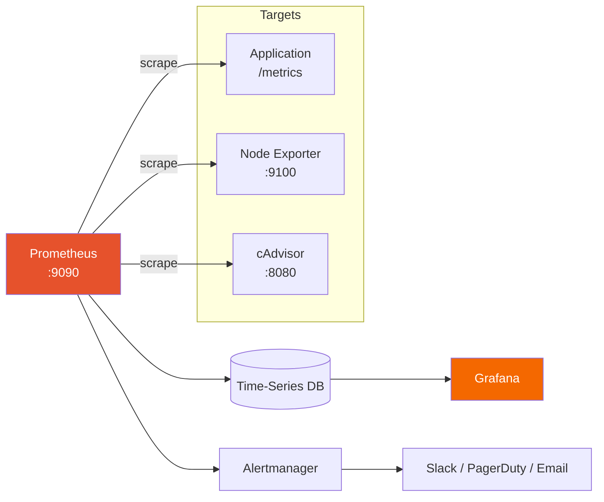

# Prometheus

Open-source metrics collection and alerting toolkit — the foundation of modern monitoring stacks.

## Architecture

## 🔜 Planned Content

- Prometheus configuration (`prometheus.yml`)
- PromQL query cookbook
- Alert rules and Alertmanager routing
- Service discovery (Kubernetes, EC2, file-based)
- Recording rules for performance
- Federation and remote write
- Custom metrics instrumentation (Python, Go)

---

[← Back to Monitoring](../monitoring/README.md) | [← Back to Main README](../README.md)
